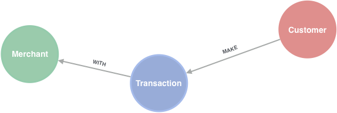

# Graph Enhanced Machine Learning For Fraud

This repository contains the code used to evaluate whether or not features created by running graph alogirthms on a standard dataset can be used to enhance supervised models predicting transactions to fraudulent or not. This was done as part of the Master's Thesis titled "The Value of Graph Databases for Financial Fraud Detection and Prevention".

The thesis in its whole can be found here: TBA

